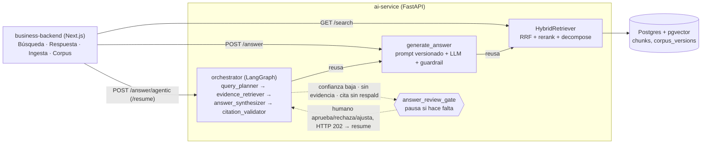

# Visual Time RAG

Proyecto final del Master en AI Engineering (lidr). Un RAG sobre la
documentación funcional del sistema **Visual Time** (seguros): 2.169 documentos
de especificación, uno por transacción, troceados, embebidos e indexados en
pgvector para poder preguntarles en lenguaje natural.

Monorepo de dos proyectos, el layout que fija el programa:

| | qué es | stack | se despliega en |
|---|---|---|---|
| [`ai-service/`](ai-service/README.md) | ingesta, chunking, embeddings, recuperación, generación, agentes | Python · FastAPI · pgvector | Railway |
| [`business-backend/`](business-backend/README.md) | el frontend y el backend de negocio: búsqueda, respuesta agentica, agentes, ingesta, corpus | Next.js · Tailwind · shadcn/ui | Vercel |

## Arquitectura



Tres formas de llegar al mismo pipeline de recuperación, con costo y control
crecientes: `/search` devuelve chunks sin interpretarlos, `/answer` los
sintetiza en una respuesta citada de un solo paso, y `/answer/agentic` la
envuelve en un grafo de cuatro agentes con privilegio mínimo (solo
`evidence_retriever` tiene una tool) y un gate humano que pausa —no siempre,
solo cuando la confianza es baja, no hay evidencia, o una cita no está
respaldada por los hits recuperados. `/answer/agentic` tiene además una
variante `/start` + `/{thread_id}/progress` que corre en background y narra
el avance por polling, para que la consola muestre a los cuatro agentes
trabajando en vez de una pantalla en blanco hasta que vuelve la respuesta.
La consola además tiene una pantalla de **agentes** que sirve el propio
servicio (`GET /config`): qué hace cada uno, qué herramientas tiene permitidas
y —para el único que llama a un modelo— su persona, modelo, temperatura y tope
de tokens, editables y persistidos. Los otros son deterministas a propósito, y
la pantalla dice por qué no tienen nada que configurar.

El modelo de respuesta es **multi-proveedor**: OpenAI, Anthropic o Moonshot
(Kimi), elegible por agente. Tres proveedores con dos adaptadores, porque
Moonshot habla el formato de OpenAI; y `temperature` se trata como capacidad
**del modelo** —los Claude de esta generación la rechazan con 400— así que se
descarta para el que no la acepta en vez de romper la llamada.

Los proveedores y sus modelos **viven en la base**, editables desde la consola:
agregar un modelo es una escritura y no un deploy, y hay un "traer del
proveedor" que le pregunta el catálogo al proveedor mismo. Las credenciales se
pueden guardar ahí **cifradas** con una master key que vive en el entorno, son
**write-only** (ningún endpoint las devuelve) y una variable de entorno siempre
les gana. Sin master key, guardar queda deshabilitado a propósito: no hay un
modo "por ahora en texto plano".

Los **embeddings no son multi-proveedor**: el corpus vive en el espacio de
`text-embedding-3-small` y cambiarlo sería reconstruirlo.

El detalle de cada agente y por qué el curso trae piezas que acá no se
replicaron (sandbox, competencia entre
estimadores) está en el [README del servicio](ai-service/README.md#agentes-y-orquestación).

## Empezar

Las dos, en dos terminales:

```bash
cd ai-service && uv sync && uv run uvicorn app.main:app --reload
```

```bash
cd business-backend && pnpm install && pnpm dev
```

Postgres con pgvector sale del compose de la raíz:

```bash
docker compose up -d
```

Vive acá y no dentro de `ai-service/` a propósito: el nombre del proyecto de
compose sale del directorio donde está el archivo, así que moverlo renombraría
el volumen y levantaría una base vacía sin decir nada.

El detalle de cada proyecto está en su propio README: el
[del servicio](ai-service/README.md) —el pipeline del corpus, pgvector, el mapa
de procesos, las evaluaciones— y el [de la consola](business-backend/README.md).

## Despliegue

| | URL |
|---|---|
| Consola | https://lidr-master.vercel.app |
| Servicio IA | https://api-service-ai-production.up.railway.app |

La consola pide sesión; el servicio pide token en todo menos `/health`.
Verificado el 2026-09-10.

Cada proyecto va a su plataforma, y cada plataforma despliega desde GitHub por
su propia integración. **No hay ningún job de CI que despliegue**: reproducirlo
sería reimplementar en YAML lo que las dos ya hacen, con rollback incluido.

| | Railway (`ai-service/`) | Vercel (`business-backend/`) |
|---|---|---|
| root directory | `ai-service` | `business-backend` |
| build | `ai-service/Dockerfile` | Next.js (`pnpm build`, que corre `prisma generate`) |
| healthcheck | `/health` | — |
| migraciones | `alembic upgrade head` al arrancar el contenedor | `pnpm db:deploy`, a mano |
| variables | `DATABASE_URL`, `OPENAI_API_KEY`, `TENANT_ID`, `DOC_VERSION`, `CORPUS_ROOT`, `SERVICE_TOKEN` | `AI_SERVICE_URL`, `AI_SERVICE_TOKEN`, `AUTH_SECRET`, `AUTH_URL`, `AUTH_GOOGLE_ID`, `AUTH_GOOGLE_SECRET`, `AUTH_DATABASE_URL`, `AUTH_DATABASE_DIRECT_URL` |
| no redesplegar de más | *Watch Paths* = `ai-service/**` | *Ignored Build Step* que sale si el commit no toca `business-backend/` |

El detalle de cada variable —qué rompe si falta— está en los dos
`.env.example`, que son el lugar donde vive esa explicación.

`AI_SERVICE_URL` es la URL pública del servicio en Railway, y es **privada**:
sin prefijo `NEXT_PUBLIC_`, porque el browser nunca la tiene que poder leer.
Toda llamada al servicio sale del servidor de Next.

`SERVICE_TOKEN` (Railway) y `AI_SERVICE_TOKEN` (Vercel) son **el mismo valor**:
el secreto compartido que el servicio exige en cada llamada. El servicio se
despliega con URL pública, así que sin esto le contesta a cualquiera —y con
`APP_ENV=production` y la variable vacía **no arranca**, porque una auth que un
despliegue se olvidó de configurar es peor que ninguna. Uno distinto por
entorno, y se genera así:

```bash
python -c "import secrets; print(secrets.token_urlsafe(32))"
```

**El orden importa: primero Vercel, después Railway.** Un header que llega a un
servicio todavía abierto se ignora, así que ese orden no tiene ventana de caída;
al revés, la consola queda con 401 hasta que Vercel termine de desplegar.
`/health` no lleva token —es el healthcheck— y es el único endpoint abierto.

**Las migraciones no se aplican igual en los dos lados, y es a propósito.** El
servicio migra al arrancar: su deploy es uno por push que toca `ai-service/` y
corre como una sola instancia, así que no hay dos procesos compitiendo por el
lock. La consola no tiene ninguna de las dos propiedades —Vercel construye en
cada commit—, así que `prisma migrate deploy` es un acto deliberado
(`pnpm db:deploy` contra `AUTH_DATABASE_DIRECT_URL`) y no un paso del build que
falla el deploy entero cuando la base está un segundo inalcanzable.

### Dos pasos que no viven en el repo

Sin ellos el despliegue queda arriba y nadie puede entrar:

1. **El redirect URI de Google.** En Google Cloud Console, agregar
   `https://<tu-app>.vercel.app/api/auth/callback/google` a los URI autorizados
   —exacto, la ruta es de Auth.js— y el origen `https://<tu-app>.vercel.app`.
   `AUTH_URL` tiene que ser esa misma URL: detrás del proxy de Vercel, sin ella
   los callbacks se arman contra el host interno y Google los rechaza.
2. **El alta del primer usuario.** La consola **no auto-provisiona**: un login
   de Google con un email que no está en la base se rechaza. `pnpm seed:admin`
   crea la fila.

`.github/workflows/ci.yml` prueba cada proyecto solo cuando cambian sus rutas,
y valida el formato de las specs siempre.

## Los datos NO están en el repo

`ai-service/data/` está gitignoreado. Contiene documentación funcional y un
export de una tabla de producción que **pertenecen a un cliente**, más el
corpus generado. El repo trae el pipeline, no los datos.

## Limitaciones conocidas y próximos pasos

- **Recuperación**: la mejor configuración medida encuentra ~45% de los
  documentos relevantes que podría encontrar (`p@10`). El golden set está
  **parcialmente revisado**: 35 de sus 65 preguntas tienen la anotación
  confirmada por una persona, y las 30 restantes están listadas con su
  evidencia en
  [`ai-service/evals/REVISION_PENDIENTE.md`](ai-service/evals/REVISION_PENDIENTE.md).
  Hasta que se cierren, el 45% es una medición sobre un conjunto a medio
  auditar — ver
  [`ai-service/evals/COMO_LEER.md`](ai-service/evals/COMO_LEER.md).
- **Generación**: sin streaming ni versiones de prompt más allá de `v1`; el
  guardrail de citas *marca* `grounded=false`, no reintenta solo.
- **Agentes**: sin persistencia ni escritura — por eso no hay `sandbox.py` ni
  un agente de competencia entre estimadores como en el curso, que sí
  escribe (`save_estimate`). El día que exista una escritura real (por
  ejemplo, curar una respuesta como FAQ verificada), esa es la señal para
  traer ese patrón, no antes.
- **Un solo tipo de documento** indexado (`functional_spec`); el pipeline
  distingue por `source_type` pero no hay un segundo tipo todavía.
- **Autenticación**: la consola autentica a las personas y el servicio exige un
  token compartido a quien lo llama. Eso corta el acceso **anónimo**, no el
  gasto ni la atribución: quien tenga el token puede llamar `POST /answer` sin
  tope, y el ledger atribuye cada llamada al portador —el BFF— y no a la persona
  que preguntó, porque el servicio no tiene identidad de usuario.
- **Despliegue de las plataformas**: el aislamiento por rutas está hecho en CI
  (`dorny/paths-filter`) pero **no** en los dashboards, así que un commit que
  toca un solo proyecto todavía puede producir un deploy del otro. Es
  configuración de Railway (*Watch Paths*) y de Vercel (*Ignored Build Step*),
  no código.
- **Próximo paso más claro**: los tres `openspec/changes/` en curso —cerrar la
  autenticación de la consola, la selección de corrida del mirror y el eval
  multi-turno—. El despliegue ya está verificado de punta a punta.

## Fuente de verdad

Este repo documenta su comportamiento con
[OpenSpec](https://github.com/Fission-AI/OpenSpec):

- **`openspec/specs/<capability>/spec.md`** — qué hace el sistema **hoy**. Es
  normativo: si el código y la spec no coinciden, uno de los dos tiene un bug.
- **`openspec/changes/`** — trabajo en curso; **`changes/archive/`** — por qué
  las cosas llegaron a ser como son.
- **`openspec/domain/`** — referencia sobre VisualTIME, el sistema fuente.
- **[`AGENTS.md`](AGENTS.md)** — el ciclo de trabajo, agnóstico de modelo y de
  harness. `CLAUDE.md` y cualquier otro archivo de harness son punteros a ese.

```bash
python scripts/validate_specs.py   # valida el formato de specs y changes
```

Corre desde la raíz y sin `uv`: es stdlib puro, para que cualquier harness y CI
lo corran igual.
