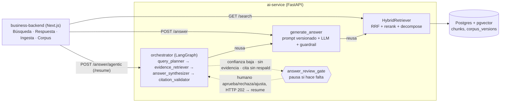

# Visual Time RAG

Proyecto final del Master en AI Engineering (lidr). Un RAG sobre la
documentación funcional del sistema **Visual Time** (seguros): 2.169 documentos
de especificación, uno por transacción, troceados, embebidos e indexados en
pgvector para poder preguntarles en lenguaje natural.

Monorepo de dos proyectos, el layout que fija el programa:

| | qué es | stack | se despliega en |
|---|---|---|---|
| [`ai-service/`](ai-service/README.md) | ingesta, chunking, embeddings, recuperación, generación, agentes | Python · FastAPI · pgvector | Railway |
| [`business-backend/`](business-backend/README.md) | el frontend y el backend de negocio | Next.js · Tailwind · shadcn/ui | Vercel |

## Arquitectura



Tres formas de llegar al mismo pipeline de recuperación, con costo y control
crecientes: `/search` devuelve chunks sin interpretarlos, `/answer` los
sintetiza en una respuesta citada de un solo paso, y `/answer/agentic` la
envuelve en un grafo de cuatro agentes con privilegio mínimo (solo
`evidence_retriever` tiene una tool) y un gate humano que pausa —no siempre,
solo cuando la confianza es baja, no hay evidencia, o una cita no está
respaldada por los hits recuperados. `/answer/agentic` tiene además una
variante `/start` + `/{thread_id}/progress` que corre en background y narra
el avance por polling, para que la consola muestre a los cuatro agentes
trabajando en vez de una pantalla en blanco hasta que vuelve la respuesta.
El detalle de cada agente y por qué el curso trae piezas que acá no se
replicaron (sandbox, competencia entre
estimadores) está en el [README del servicio](ai-service/README.md#agentes-y-orquestación).

## Empezar

Las dos, en dos terminales:

```bash
cd ai-service && uv sync && uv run uvicorn app.main:app --reload
```

```bash
cd business-backend && pnpm install && pnpm dev
```

Postgres con pgvector sale del compose de la raíz:

```bash
docker compose up -d
```

Vive acá y no dentro de `ai-service/` a propósito: el nombre del proyecto de
compose sale del directorio donde está el archivo, así que moverlo renombraría
el volumen y levantaría una base vacía sin decir nada.

El detalle de cada proyecto está en su propio README: el
[del servicio](ai-service/README.md) —el pipeline del corpus, pgvector, el mapa
de procesos, las evaluaciones— y el [de la consola](business-backend/README.md).

## Despliegue

Cada proyecto va a su plataforma, y cada plataforma despliega desde GitHub por
su propia integración. **No hay ningún job de CI que despliegue**: reproducirlo
sería reimplementar en YAML lo que las dos ya hacen, con rollback incluido.

| | Railway (`ai-service/`) | Vercel (`business-backend/`) |
|---|---|---|
| root directory | `ai-service` | `business-backend` |
| build | `ai-service/Dockerfile` | Next.js |
| healthcheck | `/health` | — |
| variables | `DATABASE_URL`, `OPENAI_API_KEY`, `TENANT_ID`, `DOC_VERSION`, `CORPUS_ROOT` | `AI_SERVICE_URL` |
| no redesplegar de más | *Watch Paths* = `ai-service/**` | *Ignored Build Step* que sale si el commit no toca `business-backend/` |

`AI_SERVICE_URL` es la URL pública del servicio en Railway, y es **privada**:
sin prefijo `NEXT_PUBLIC_`, porque el browser nunca la tiene que poder leer.
Toda llamada al servicio sale del servidor de Next.

`.github/workflows/ci.yml` prueba cada proyecto solo cuando cambian sus rutas,
y valida el formato de las specs siempre.

## Los datos NO están en el repo

`ai-service/data/` está gitignoreado. Contiene documentación funcional y un
export de una tabla de producción que **pertenecen a un cliente**, más el
corpus generado. El repo trae el pipeline, no los datos.

## Limitaciones conocidas y próximos pasos

- **Recuperación**: la mejor configuración medida encuentra ~45% de los
  documentos relevantes que podría encontrar (`p@10` sobre un golden set
  todavía `PENDING_REVIEW` — ver
  [`ai-service/evals/COMO_LEER.md`](ai-service/evals/COMO_LEER.md)).
- **Generación**: sin streaming ni versiones de prompt más allá de `v1`; el
  guardrail de citas *marca* `grounded=false`, no reintenta solo.
- **Agentes**: sin persistencia ni escritura — por eso no hay `sandbox.py` ni
  un agente de competencia entre estimadores como en el curso, que sí
  escribe (`save_estimate`). El día que exista una escritura real (por
  ejemplo, curar una respuesta como FAQ verificada), esa es la señal para
  traer ese patrón, no antes.
- **Un solo tipo de documento** indexado (`functional_spec`); el pipeline
  distingue por `source_type` pero no hay un segundo tipo todavía.
- **Próximo paso más claro**: cerrar el despliegue continuo de las dos
  plataformas (hoy documentado, pendiente de verificar de punta a punta) y
  promover los `openspec/changes/` en curso a `openspec/specs/` una vez
  verificados en producción.

## Fuente de verdad

Este repo documenta su comportamiento con
[OpenSpec](https://github.com/Fission-AI/OpenSpec):

- **`openspec/specs/<capability>/spec.md`** — qué hace el sistema **hoy**. Es
  normativo: si el código y la spec no coinciden, uno de los dos tiene un bug.
- **`openspec/changes/`** — trabajo en curso; **`changes/archive/`** — por qué
  las cosas llegaron a ser como son.
- **`openspec/domain/`** — referencia sobre VisualTIME, el sistema fuente.
- **[`AGENTS.md`](AGENTS.md)** — el ciclo de trabajo, agnóstico de modelo y de
  harness. `CLAUDE.md` y cualquier otro archivo de harness son punteros a ese.

```bash
python scripts/validate_specs.py   # valida el formato de specs y changes
```

Corre desde la raíz y sin `uv`: es stdlib puro, para que cualquier harness y CI
lo corran igual.
