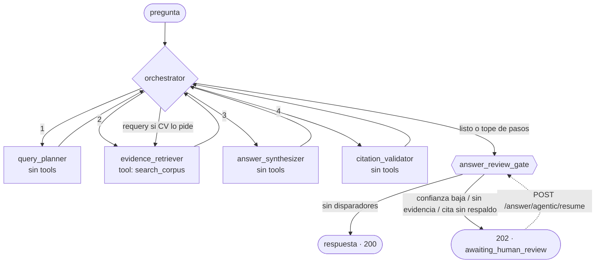

# Visual Time RAG — servicio IA

Pipeline de ingesta y chunking de documentos funcionales de Visual Time
(seguros), como paso previo a indexarlos en un RAG con pgvector.

Uno de los dos proyectos del repo; el otro es `business-backend/`. Portada del
monorepo en el [README de la raíz](../README.md). **Todos los comandos de este
archivo corren desde `ai-service/`.**

## Puesta en marcha

```bash
cd ai-service
uv sync
cp .env.example .env      # completar si vas a usar la capa de embeddings
uv run pytest
```

### Los datos NO están en el repo

`ai-service/data/` está en `.gitignore`. Contiene documentación funcional y un export de
una tabla de producción que **pertenecen a un cliente**, más el corpus generado
(76 MB, reproducible en 12 s). El repo trae el pipeline, no los datos.

Para correrlo con un corpus propio:

```bash
uv run python scripts/chunk_corpus.py --root "RUTA/A/TUS/DOCUMENTOS" --out data/chunks --tenant mi_cliente --doc-version "mi version"
```

Los tests que usan documentos reales como fixture necesitan esos archivos en
`data/`; sin ellos fallan por archivo faltante, no por lógica.

Opcional, para resolver el breadcrumb Módulo → Submódulo → Transacción:

```bash
uv run --with xlrd python scripts/import_windows_tree.py "RUTA/Windows.xls"
```

Sin ese CSV el pipeline corre igual y deja el breadcrumb sin resolver.

Ese export trae además el **tipo de ventana** (`NWINDOWTY`), que dice cómo se
opera cada transacción —puntual, secuencia o masiva, con o sin encabezado— y cuyo
tipo 8 **declara** que un código es un menú. Eso reemplazó una heurística que
acertaba 192 de 205: ver
[`openspec/domain/visualtime-window-types.md`](../openspec/domain/visualtime-window-types.md).

## Persistencia en pgvector

```bash
(cd .. && docker compose up -d)     # el compose vive en la raíz del repo
uv run alembic upgrade head
uv run python scripts/load_pgvector.py --dry-run
uv run python scripts/load_pgvector.py
```

Dos tablas: `chunks` con el texto, el vector y los campos filtrables en
columnas, y `corpus_versions`, donde un índice único parcial hace **imposible**
que un cliente tenga dos versiones activas.

La carga es por `COPY` (el ORM define el esquema y responde consultas; mover
57.101 filas de 1536 floats es del driver) e idempotente por
`(tenant_id, doc_version, content_hash)`: volver a correrla no inserta nada.
`--prune` borra las filas cuyo texto ya no está en el corpus.

La carga es idempotente en el sentido que importa —el conteo de filas no crece—
pero **no es ciega a la metadata**: refresca las columnas de metadata de las filas
que ve, que es lo que permite que un campo nuevo llegue a filas que ya existen. El
embedding nunca se reescribe: está atado al texto, y si el texto cambió entonces
cambió el hash y es una fila nueva.

**Un detalle que cuesta caro no saber:** una búsqueda por similitud con filtros
puede devolver **cero resultados** aunque miles de filas cumplan el filtro. HNSW
recorre sus candidatos más cercanos y recién después aplica el `WHERE`. La
configuración `hnsw.iterative_scan` se fija en la conexión, no en cada consulta.

### Tests

```bash
uv run pytest
```

Corre sin base: los tests que la necesitan se saltean diciendo por qué. Con
el compose de la raíz levantado corren de verdad — son los que verifican lo que no se
puede emular: el stemming español, el índice parcial y la búsqueda filtrada.

## Mapa de procesos y contexto del CAG

```bash
uv run python scripts/build_process_map.py --dry-run
```

```bash
uv run python scripts/build_process_map.py
```

Arma un grafo de 4.061 transacciones desde tres fuentes, y las **tres relaciones
nunca se colapsan** porque no afirman lo mismo:

| tipo | cantidad | qué afirma |
|---|---:|---|
| `menu_parent` | 2.672 | dónde vive la transacción en el menú |
| `references` | 1.390 | que un documento menciona a otro |
| `requires` | **39** | que hay que ejecutar una antes de otra |

Los mayores emisores de `references` son documentos índice (676 de las 1.390), o
sea tabla de contenidos y no relación de negocio — y van marcados como tales.

Las `requires` salen solo de donde un documento lo declara. **No se infiere
nada:** que dos procesos escriban en la misma tabla no crea una arista.

Sale `data/process_map.json` (el artefacto reproducible), `data/cag_context.md`
(**90.067 tokens**, el 70% del techo de 128k) y las aristas en
`process_map_edges`, indexadas en las dos puntas para expandir en cualquier
dirección.

**El contexto empieza declarando lo que NO cubre**, adentro y no al lado: 794
transacciones no cuelgan de ningún menú y eso no significa que no existan; fuera
de las 39 `requires` la documentación no dice en qué orden se ejecutan los
procesos. Un modelo que reciba el mapa sin sus límites va a contestar que una
transacción no existe cuando lo que pasa es que no está en el menú.

Si el contexto supera el techo, el build **falla** en vez de truncar: medio mapa
se lee como uno entero.

## Evaluación de la generación

```bash
uv run python scripts/eval_generation.py --source curated
```

Para cada pregunta del golden set con un `document_id` esperado, confirma que
las `citations` de la respuesta lo incluyen. Método y números en
[`evals/GENERATION_EVAL.md`](evals/GENERATION_EVAL.md).

## Evaluación de la recuperación

```bash
uv run python scripts/draft_golden_set.py    # borradorea el golden set del corpus
uv run python scripts/eval_retrieval.py      # precision@k y latencia por configuración
uv run python scripts/eval_retrieval_proxy.py --limit 60   # proxy rápido, para iterar
```

30 preguntas enfocadas en pólizas, siniestros, cobranzas y diseñador, con 130
documentos relevantes anotados y 85 distractores deliberados. Cada pregunta lleva
en `provenance` el criterio verificable del que salió, y está
**`PENDING_REVIEW`**: un golden set derivado por el mismo sistema que se evalúa
contra él compara configuraciones, no mide calidad.

**[`evals/COMO_LEER.md`](evals/COMO_LEER.md) explica cada término** —
`precision@k`, techo, distractores, ramas, tope por documento, RRF — sobre una
pregunta real y con los resultados que dio.

En una frase: la mejor configuración encuentra alrededor del **45% de los
documentos relevantes que podría encontrar**.

## Agentes y orquestación

```bash
curl -X POST http://localhost:8000/answer/agentic \
  -H "Content-Type: application/json" \
  -d '{"question": "¿Qué valida CA014 antes de aceptar la póliza?"}'
```

`POST /answer/agentic` no reemplaza a `/answer`: lo envuelve en un grafo
LangGraph de cuatro agentes especialistas, cada uno con el mínimo privilegio
que necesita, ruteados dinámicamente en vez de en un orden fijo:



- **`orchestrator`** (`app/domain/graph/orchestrator.py`) decide el próximo
  agente vía `Command(goto=...)`, no un grafo estático — con tres frenos
  deterministas: tope de pasos (`ANSWER_ORCHESTRATOR_MAX_STEPS`), una guarda
  de legalidad que rechaza un destino cuyos inputs no están listos o que ya
  corrió, y una escalera de fallback determinística
  (`query_planner → evidence_retriever → answer_synthesizer →
  citation_validator`) cuando el ruteo no tiene un candidato obvio.
- **`query_planner`, `answer_synthesizer`, `citation_validator`** no tienen
  ninguna tool — razonan sobre el estado. **`evidence_retriever`** es el
  único con una, `search_corpus`, que envuelve el mismo `HybridRetriever`
  que usan `/search` y `/answer` — no hay una segunda implementación de
  recuperación. La tabla de privilegios vive en `app/domain/graph/privilege.py`
  (`AGENT_PRIVILEGES`) y cada intento, permitido o denegado, queda auditado
  en `agent_contributions`.
- **`citation_validator`** puede pedir un *requery* a `evidence_retriever`
  con una consulta refinada en vez de conformarse con hits insuficientes —
  la diferencia real entre este endpoint y `/answer`, que no puede volver
  a preguntar.
- **`answer_review_gate`** (`app/domain/graph/gate.py`) pausa el grafo
  (HTTP 202, `status: "awaiting_human_review"`) solo cuando
  `review_reasons(state)` no está vacío: confianza bajo
  `ANSWER_ORCHESTRATOR_CONFIDENCE_THRESHOLD`, una cita sin respaldo en los
  hits, o ninguna evidencia encontrada. Sin disparadores, sigue de largo —
  "un gate que siempre pausa es un formulario, no un control". Se resume
  con `POST /answer/agentic/resume` (`thread_id` + `decision`:
  `approve`/`reject`/`adjust`).
- El estado persiste por `thread_id` en un `AsyncPostgresSaver`
  (`app/domain/graph/checkpointer.py`), sobre el mismo Postgres del resto
  del servicio — sin eso, resumir después de una pausa no tendría de dónde
  partir.

**Lo que el curso trae y acá no se replicó, con la razón:**

- `sandbox.py` / `persistence_agent` — existen en el curso porque
  `save_estimate` es una escritura irreversible que hay que aislar por
  tenant. `/answer/agentic` no escribe nada todavía; sandboxear una
  escritura que no existe es la abstracción prematura que
  [`openspec/project.md`](../openspec/project.md) prohíbe. El día que
  aparezca una escritura real (curar una respuesta como FAQ verificada, por
  ejemplo), ese es el momento de traerlo.
- `competition.py` (dos estimadores con prioridades opuestas, sintetizados
  en un rango) — tiene sentido para un número en disputa (horas de
  estimación); no hay un equivalente natural para una pregunta sobre una
  especificación funcional, que tiene una respuesta correcta verificable
  contra el documento, no un rango.

## Fuente de verdad

`openspec/`, en la raíz del repo, documenta el comportamiento de los dos
proyectos. Las specs de este servicio nombran sus rutas **relativas a
`ai-service/`**: donde una spec dice
`app/generation/rag/chunking/functional_spec.py`, el archivo está en
`ai-service/app/generation/rag/chunking/functional_spec.py`.

El ciclo de trabajo está en [`AGENTS.md`](../AGENTS.md) y el detalle en el
[README de la raíz](../README.md).

## Estructura

Replica la arquitectura por capas del curso (rama `session_16` de
[LIDR-academy/ai-engineering](https://github.com/LIDR-academy/ai-engineering/tree/session_16/ai-service/app)):

```
app/
├── config.py                                # Settings (pydantic-settings)
├── dependencies.py                          # composition root: chunker, embedder, LLM
├── main.py                                  # FastAPI app, structlog, routers
├── api/
│   ├── documents.py                         # POST /documents/ingest (router delgado)
│   ├── search.py                            # GET /search
│   ├── answer.py                            # POST /answer
│   └── answer_agentic.py                    # POST /answer/agentic (+ /resume)
├── foundation/
│   ├── persistence/database.py              # Base, engine sync (psycopg) y async (asyncpg)
│   ├── llm/wrapper.py                       # chat completions (cliente armado en DI)
│   └── prompts/answer/v1/                   # system.j2 + user.j2
├── domain/
│   ├── schemas.py                           # AnswerAgentState y sus acumuladores keyed
│   └── graph/
│       ├── orchestrator.py                  # Command(goto=...), tres frenos deterministas
│       ├── privilege.py                     # AGENT_PRIVILEGES, guarded_dispatch, auditoría
│       ├── gate.py                          # review_reasons puro + answer_review_gate
│       ├── tools.py                         # search_corpus envuelve HybridRetriever
│       ├── checkpointer.py                  # AsyncPostgresSaver por thread_id
│       ├── build.py                         # arma el StateGraph
│       └── agents/                          # query_planner, evidence_retriever,
│                                             # answer_synthesizer, citation_validator
└── generation/rag/
    ├── schemas.py                           # Chunk, ChunkMetadata, Reference, manifiestos
    ├── chunking/
    │   ├── base.py                          # count_tokens() (tiktoken, compartido)
    │   ├── normalizer.py                    # fin de línea + reparación de tablas rotas
    │   └── functional_spec.py               # FunctionalSpecChunker
    ├── embedding/
    │   ├── embedder.py                      # protocolo Embedder, OpenAI, HashEmbedder
    │   ├── sidecar.py                       # IO del .npy + .index.json
    │   └── runner.py                        # planificación incremental y verificación
    ├── retrieval/
    │   ├── fusion.py                        # RRF por posición, tope por documento
    │   └── hybrid.py                        # las tres ramas y el detector de identificadores
    ├── process_map/
    │   ├── graph.py                         # nodos, aristas, deteccion de ciclos
    │   ├── requisites.py                    # precedencia declarada en Requisitos
    │   ├── builder.py                       # armado desde las tres fuentes
    │   └── cag.py                           # el contexto precargable, medido
    ├── store/
    │   ├── models.py                        # chunks, corpus_versions, process_map_edges
    │   ├── loader.py                        # COPY masivo e idempotente
    │   └── repository.py                    # búsqueda por similitud con filtros
    ├── prompt_builder.py                    # contexto con procedencia visible
    ├── guardrails.py                        # citas vs. hits recuperados
    └── answer.py                            # orquestación retrieve → LLM → guardrail
```

### Próximos pasos (no de este cambio)

- Streaming de la respuesta.
- Versiones de prompt `v2` / `v3`, con evidencia de qué cambió y por qué.
- Un segundo tipo de documento (`source_type` ya está en la clave única de
  `chunks`, el chunker todavía no distingue un segundo caso real).

No repliqué `app/ingestion/` del curso (catálogo YAML + jobs en background +
Postgres): esa capa es para otro tipo de fuente y trae infraestructura que este
endpoint no necesita. Tampoco repliqué su tabla de chunks por tipo de fuente
(`budget_chunks`, `transcript_chunks`, ...): el curso ingiere tres clases de
documento y este proyecto una sola.

## Embeddings

`text-embedding-3-small` (1536 dims) sobre el corpus troceado. Los vectores van
a un **sidecar binario**, no inline en el corpus JSON: 380 MB en `.npy` float32
contra ~1,8 GB del mismo dato serializado como texto.

```bash
uv run python scripts/embed_corpus.py --dry-run
```

```bash
uv run python scripts/embed_corpus.py
```

La corrida es **incremental y reanudable**. Una fila se identifica por su
`content_hash`, nunca por su posición:

- hash en el sidecar y en el corpus → se reutiliza el vector
- hash solo en el corpus → se embebe
- hash solo en el sidecar → se descarta (su chunk ya no existe)

Volver a correr sobre un corpus sin cambios hace **cero** llamadas a la API. Un
lote que agota sus reintentos se reporta y la corrida sigue; el código de salida
es distinto de cero para que quien la invoque sepa que falta algo.

Sobre el corpus real: 61.901 chunks → **56.480 filas** (8,8% son texto repetido y
se embebe una sola vez), 4,76 M tokens, ~US$ 0,10.

## Uso

```bash
uv sync
uv run uvicorn app.main:app --reload
```

Swagger en `http://localhost:8000/docs`. Endpoints:

- `POST /documents/ingest` — body JSON `{"filename": "...", "content": "..."}`.
  `content` es el **texto** del markdown, no una ruta — el servicio nunca lee
  del disco. Pensado para llamadores programáticos.
- `POST /documents/ingest-file` — subida de archivo (multipart). En Swagger
  aparece como un botón "Choose File" nativo; es la forma más cómoda de
  probar a mano con los `.md` de `data/policies/`.
- `GET /search` — chunks relevantes, con procedencia.
- `POST /answer` — respuesta citada: recupera con el mismo pipeline que
  `/search`, arma un prompt, llama al LLM y marca `grounded=false` si la
  prosa cita un `document_id` que no estaba en los hits. `citations` son
  esos hits, no los marcadores del modelo.
- `POST /answer/agentic` (+ `POST /answer/agentic/resume`) — lo mismo que
  `/answer`, orquestado por cuatro agentes con privilegio mínimo y un gate
  humano que pausa (HTTP 202) cuando la confianza es baja o una cita no
  tiene respaldo. Detalle completo en
  [Agentes y orquestación](#agentes-y-orquestación).

```bash
curl -X POST http://localhost:8000/documents/ingest-file \
  -F "file=@data/policies/ca014.md;type=text/markdown"
```

## Tests

```bash
uv run pytest -v
```

`tests/generation/rag/test_normalizer.py` cubre el reparador de tablas
rotas contra 3 fixtures reales (CA014 "Ramos generales/Vida", las 2 tablas
"Tipo de registro/Transacción" de CA001, las 5 filas "Tipo de inicio de
vigencia/Fecha a mostrar" de CA001). `tests/generation/rag/test_functional_spec_chunker.py`
corre el chunker completo sobre los 3 documentos reales en `data/policies/`
(`ca001.md`, `ca004.md`, `ca014.md`), verificando el techo de ~500 tokens
por chunk narrativo, 1 chunk por fila de Campos/Validaciones, y la
extracción de referencias cruzadas (`` `CAC011` ``, `<DF009>`).

## Notas de diseño

- Clases y atributos en inglés; docstrings/comentarios bilingües (`EN || ES`).
- `metadata` (`ChunkMetadata`) y `stats` (`IngestStats`) son modelos
  Pydantic propios, no `dict` genéricos, para que Swagger muestre sus
  atributos reales tanto en "Schema" como en "Example Value".
- El id del documento se extrae solo del bloque de título (antes del primer
  `## `), para no confundirlo con referencias a otros documentos más abajo
  en el texto.
- No todos los documentos tienen `# ` en el título (CA014 no lo tiene); el
  extractor cae al primer renglón no vacío.
- Los nombres de sección (`Función`, `Efecto`, ...) se mantienen en español
  en `metadata.section`: son el heading literal del documento fuente, no
  identificadores de código — traducirlos rompería la trazabilidad.
- Chunking jerárquico/semántico avanzado, overlap y fixed-size splitting
  quedan deliberadamente fuera de alcance — la estructura del documento ya
  da los límites.
